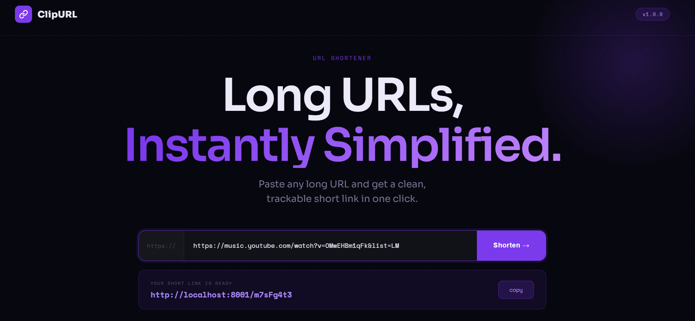
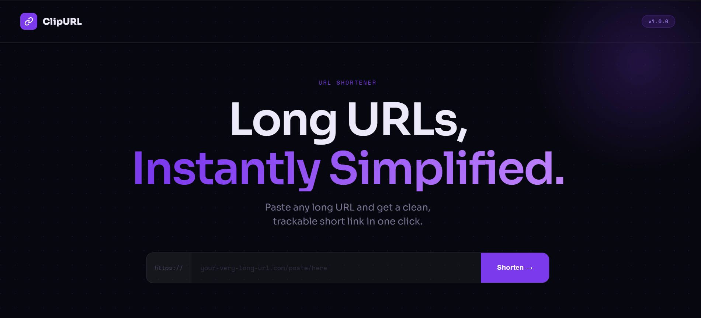

<div align="center">


# 🔗 ClipURL

**A fast, minimal URL shortener built with Node.js, Express, and MongoDB.**  
Paste any long URL, get a clean short link, and track every click with built-in analytics.

[Features](#-features) · [Project Structure](#-project-structure) · [Getting Started](#-getting-started) · [Screenshots](#-screenshots)

</div>

---
## Link

```
https://url-shortener-xi-three-48.vercel.app/

```

---
---

## ✨ Features

- **Instant shortening** — generates a unique 8-character ID using `nanoid`
- **Click tracking** — every redirect is logged with a timestamp in MongoDB
- **Analytics endpoint** — query total clicks and full visit history per link
- **EJS templating** — server-side rendered UI, no frontend framework needed
- **Clean REST API** — easily extendable for future features

---

## 📁 Project Structure

```
url-shortener/
├── controller/
│   └── url.js          # Business logic — generate short URL, get analytics
├── model/
│   └── url.js          # Mongoose schema (shortId, redirectURL, visitHistory)
├── routes/
│   ├── url.js          # POST /url, GET /url/analytics/:shortId
│   └── staticRouter.js # GET / → renders home page
├── views/
│   └── home.ejs        # Main UI template
├── connect.js          # MongoDB connection helper
├── index.js            # Express app entry point
└── package.json
```

---

## 🚀 Getting Started

### Prerequisites

- [Node.js](https://nodejs.org/) v18+
- [MongoDB Atlas setup](https://www.mongodb.com/)

### Installation

```bash
# 1. Clone the repo
git clone [https://github.com/Nitakshi/Url-Shortener.git]
cd url-shortener

# 2. Install dependencies
npm install

# 3. Start the server
node index.js
```

The server starts at **http://localhost:8001**

> Make sure MongoDB is running before starting the server:
> ```bash
> mongod --dbpath /your/db/path
> ```

---

## 📦 Dependencies

| Package      | Purpose                              |
|--------------|--------------------------------------|
| `express`    | Web framework                        |
| `mongoose`   | MongoDB ODM                          |
| `nanoid`     | Unique short ID generation           |
| `ejs`        | Server-side HTML templating          |

---

## 🖼️ Screenshots





---

## 📄 License

MIT 

---

<div align="center">
  <sub>Built with Node.js · Express · MongoDB</sub>
</div>
